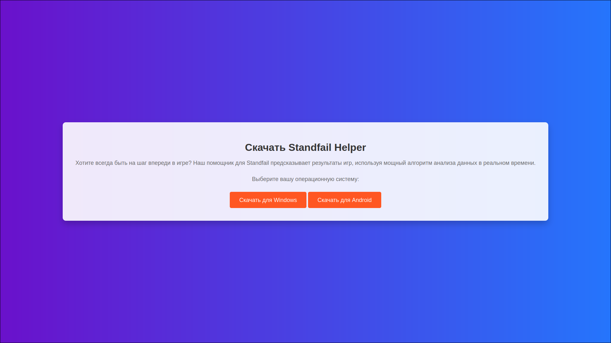

# 🎣 Standfail Phishing Template

This project is designed for **educational purposes**, providing a simple phishing template within a Docker environment. It includes an HTML phishing page that can be customized and deployed for awareness and training purposes.

---

## ✨ Features

- **🛠 Dockerized Environment**: Easy setup using Docker.
- **📦 Malicious File Downloads**: Serve executable (`.exe`) and Android package (`.apk`) files as convenient downloads.
- **🔄 Customizable Payloads**: Supports both `.apk` and `.exe` files for demonstration purposes.

---

## 🚀 Installation & Usage

Follow these steps to set up and run the standfail phishing template:

1. **Clone the Repository**:
   ```bash
   git clone https://github.com/ilolm/phishing_standfail.git
   cd phishing_standfail
   ```

2. **Add Your Payloads**:
  - Place your .exe payload in the html directory and rename it to `standfail-helper.exe`.
  - Place your .apk payload in the html directory and rename it to `standfail-helper.apk`.

3. **Build the Docker Image**:
   ```bash
   docker image build -t standfail .
   ```

4. **Run the Docker Container**:
   ```bash
   docker container run -d -p 80:80 standfail
   ```
   
5. **Access the Phishing Page**:
    - Open your browser and navigate to http://localhost to view the phishing page.
    - Test the download buttoms.

---

## 🖼️ Screenshot



---

## ⚠️ Disclaimer

This project is intended strictly for **educational purposes**. Unauthorized use of this template for any malicious activity is illegal and unethical. Always ensure you have explicit permission before conducting any security testing.

---

## 📄 License

This project is licensed under the MIT License. See the [LICENSE](./LICENSE) file for more details.
